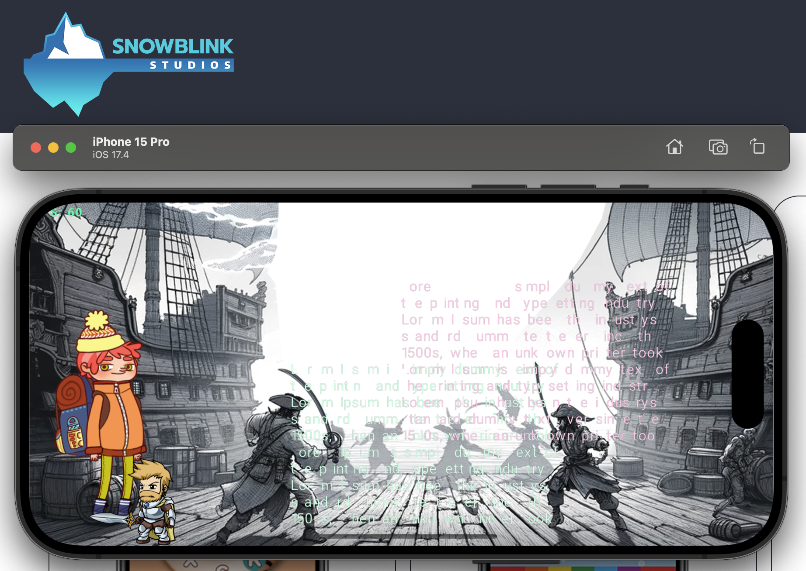
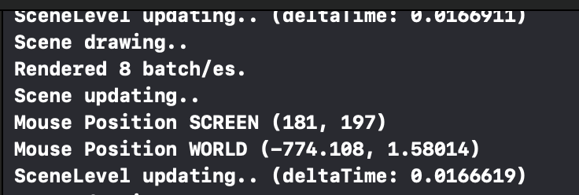

# Snowpulse
2d Game Framework made in C++

# Current State

# Supported Platforms
- Windows (OpenGL)
- macOS (Metal)
- iOS (Metal)

## Coding Convention
[Google C++ Style Guide](https://google.github.io/styleguide/cppguide.html)